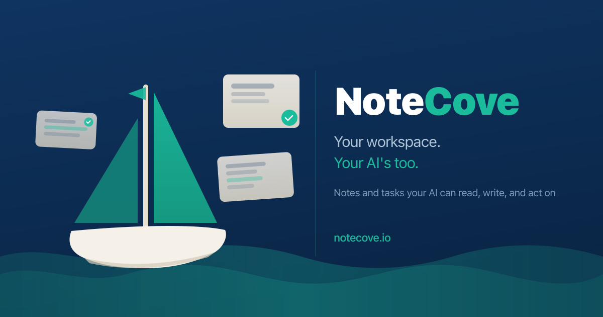

<p align="center">
  
</p>

# NoteCove Skills for Claude Code

[NoteCove](https://notecove.io) is a local-first notes and tasks app for Mac. Your notes, folders, and projects are all readable and writable by the `notecove` CLI — making it a natural home for AI-assisted workflows.

This repo contains Claude Code skills that integrate directly with your NoteCove instance.

---

## Skills

### `/daily` — Daily briefing

Starts your day by compiling a fresh daily note in NoteCove: pulls outstanding todos from recent notes, reads active tasks from your projects, checks your calendar and the weather, scans open PRs, and writes a prioritized action list with a short coaching brief.

**Install:** run `/daily-installation` once to configure the skill for your NoteCove folders and projects.

---

### `/feature-nc` — Feature implementation workflow

A structured, multi-phase workflow for implementing features against a NoteCove codebase. Guides Claude through analysis, planning, critique, and implementation — tracking everything as Notecove notes and tasks.

**Watch it in action:**

[](https://www.youtube.com/watch?v=SAmejhaNZxk)

**Install:** run `/feature-nc-installation` once to configure the skill for your NoteCove projects.

---

## Installation

1. Clone this repo somewhere on your machine:
   ```bash
   git clone https://github.com/drewcsillag/evoceton.git
   cd evoceton
   ```

2. Open the repo in Claude Code:
   ```bash
   claude .
   ```

3. Run the installation skill for each skill you want to use:
   - `/daily-installation` — sets up the daily skill
   - `/feature-nc-installation` — sets up the feature workflow skill

The installation skills will discover or create the required NoteCove folders and projects, and patch the skill files with the correct IDs for your instance.

> **Prerequisites:** The `notecove` CLI must be installed and connected to your NoteCove instance. The CLI is bundled with [NoteCove for Mac](https://notecove.io).
